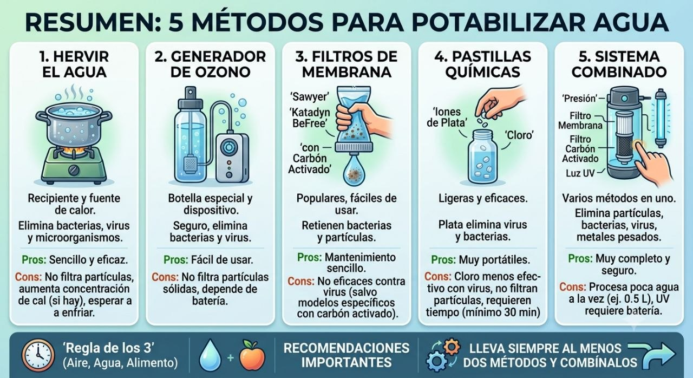

# 5 métodos para potabilizar agua

Vídeo demostrativo sobre cómo hacer potable el agua en contexto de preparacionismo. A continuación, un resumen visual con los cinco métodos principales.

<iframe width="100%" height="360" src="https://www.youtube.com/embed/9Y6QxLR6v8Q" title="YouTube video player" frameborder="0" allow="accelerometer; autoplay; clipboard-write; encrypted-media; gyroscope; picture-in-picture" allowfullscreen style="border:1px solid #ccc;border-radius:8px;"></iframe>

## Resumen del vídeo (5 métodos principales)

1. Hervir el agua [00:36]
Es el método más sencillo y conocido. Requiere un recipiente y una fuente de calor. Elimina bacterias, virus y microorganismos. Sin embargo, no filtra partículas y, si el agua tiene cal, la concentración de esta aumenta con la evaporación. Además, hay que esperar a que se enfríe para beberla.

1. Generador de ozono [05:45]
Se utiliza una botella especial con un dispositivo que genera burbujas de ozono. Es seguro, elimina bacterias y virus, y es fácil de usar. Como desventajas, no filtra partículas sólidas y depende de una batería que debe recargarse.

1. Filtros de membrana [09:04]
Son populares y fáciles de usar. Retienen bacterias y partículas. Algunos modelos vienen con su propia botella. Su mantenimiento es sencillo (limpiándolos con una jeringuilla o enjuagándolos). No son eficaces contra virus, a menos que incluyan carbón activado.

1. Pastillas químicas [13:41]
Se utilizan pastillas de iones de plata o de cloro, que se añaden a un recipiente con agua. Son ligeras y eficaces. Las de plata eliminan virus y bacterias, pero las de cloro no son tan efectivas con los virus. No filtran partículas y requieren al menos media hora para hacer efecto.

1. Sistema combinado [16:22]
Este método integra varios sistemas en uno. Utiliza un recipiente donde se ejerce presión para pasar el agua a través de un filtro de membrana y otro de carbón activado, y finalmente una luz ultravioleta. Elimina partículas, bacterias, virus y metales pesados. Su principal desventaja es que solo procesa medio litro a la vez y la luz ultravioleta requiere batería.

## Recomendaciones importantes
- 🕒 **Regla de los 3**: aire, agua y alimento son críticos para la supervivencia (prioriza el agua).
- 💡 **Lleva siempre al menos dos métodos y combínalos** para aumentar la seguridad.

**Enlace al vídeo:** [YouTube — 5 métodos para potabilizar agua](https://youtu.be/9Y6QxLR6v8Q?is=oo_Glja_iSiymS_K)

**Aplicación en preparacionismo:** el agua potable es el recurso nº 1 tras el aire. Disponer de métodos redundantes (p. ej. hervir + pastillas, o filtro + UV) garantiza agua segura aunque falle uno.
