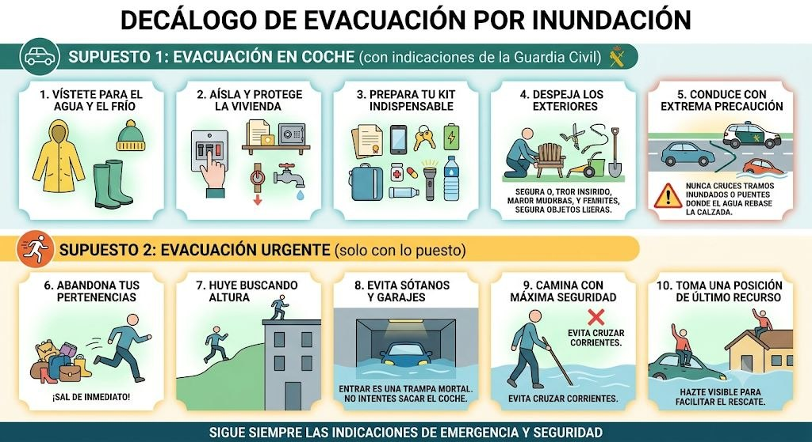

# Evacuación por inundación

1. Decálogo de Evacuación por Inundación

Las inundaciones son extremadamente peligrosas por la fuerza del agua y lo imprevisible de las corrientes. Al igual que con el fuego, la rapidez es fundamental, pero en este caso la prioridad absoluta es ganar altura y evitar cualquier cauce. Aquí tienes el decálogo adaptado a este riesgo, dividido en los mismos dos supuestos:

## Supuesto 1: Evacuación en coche (con indicaciones de la Guardia Civil)
_En este escenario cuentas con un mínimo margen de tiempo y la evacuación está siendo coordinada por las autoridades._

1. Vístete para el agua y el frío: Utiliza ropa impermeable, abrigo y, sobre todo, botas de agua o calzado cerrado con suela gruesa y fuertemente antideslizante.
1. Aísla y protege la vivienda: Corta el suministro de electricidad, agua y gas. Sube a los pisos superiores los productos químicos (como lejía o pintura), documentos importantes y objetos de valor para que no contaminen el agua ni se destruyan.
1. Prepara tu kit indispensable: Lleva contigo tu cartera con documentación, las llaves, tu teléfono móvil, una batería externa, medicación vital que tomes a diario, una linterna y agua potable embotellada.
1. Despeja los exteriores: Mete dentro de casa o amarra firmemente los muebles de jardín, herramientas y cualquier objeto suelto en el patio; el agua puede arrastrarlos y convertirlos en proyectiles que dañen estructuras o bloqueen desagües.
1. Conduce con extrema precaución: Sigue estrictamente la ruta indicada por la Guardia Civil. Nunca cruces tramos inundados ni puentes donde el agua rebase la calzada; tan solo 30 centímetros de agua en movimiento pueden hacer flotar y arrastrar a la mayoría de los vehículos.

## Supuesto 2: Evacuación urgente (solo con lo puesto)
_El nivel del agua sube rápidamente o hay una riada inminente. No hay tiempo para sacar el coche ni recoger cosas. Tu vida es la única prioridad._

1. Abandona tus pertenencias: No pierdas ni un solo segundo recogiendo enseres materiales o intentando salvar bienes. El agua sube a una velocidad engañosa; sal de inmediato.
1. Huye buscando altura: Aléjate rápidamente de ríos, ramblas, barrancos, cauces secos y zonas bajas. Busca terrenos elevados, colinas o los pisos más altos de los edificios de hormigón cercanos.
1. Evita sótanos y garajes bajo ningún concepto: Bajar a por el coche es una trampa mortal. Los garajes subterráneos se inundan en cuestión de segundos y la presión del agua bloqueará las puertas desde el exterior, impidiendo cualquier posibilidad de escape.
1. Camina con máxima seguridad: Si te ves obligado a caminar por zonas inundadas, usa un palo o bastón para tantear el suelo delante de ti, ya que pueden faltar tapas de alcantarilla o haber socavones ocultos. Evita cruzar corrientes; 15 centímetros de agua a gran velocidad bastan para derribar a un adulto.
1. Toma una posición de último recurso si te acorralan: Si el agua te atrapa dentro de tu vehículo y el nivel sigue subiendo, sal inmediatamente por la ventana y súbete al techo. Si estás en una vivienda y el agua te rodea por completo, sube al tejado o a la terraza más alta posible y hazte visible para facilitar el rescate aéreo o en embarcación.
